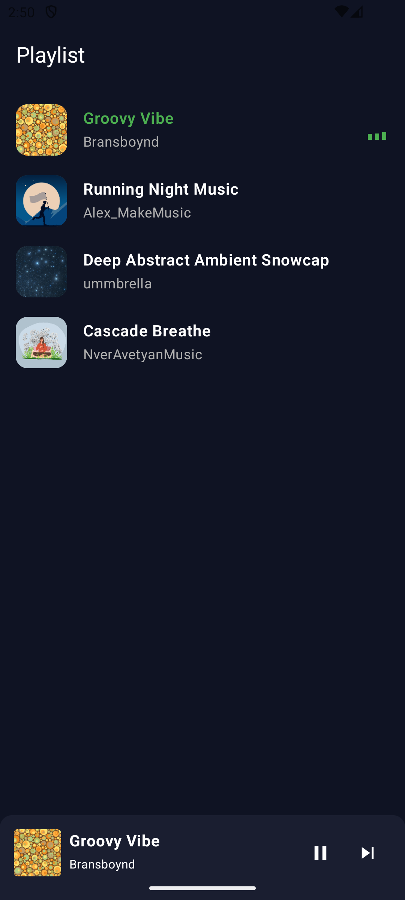
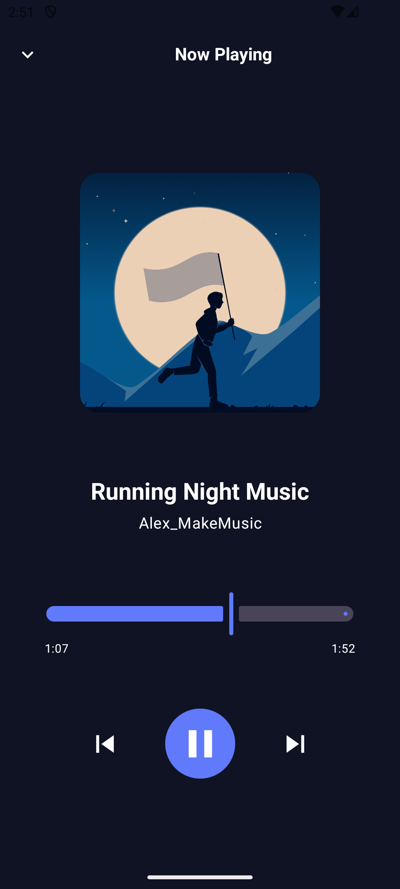
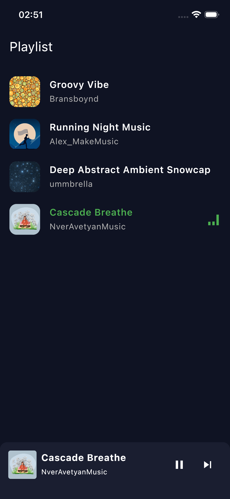
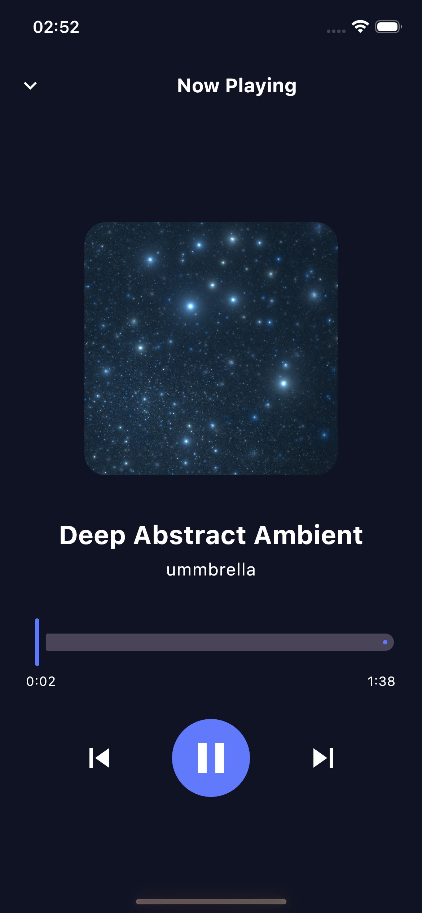
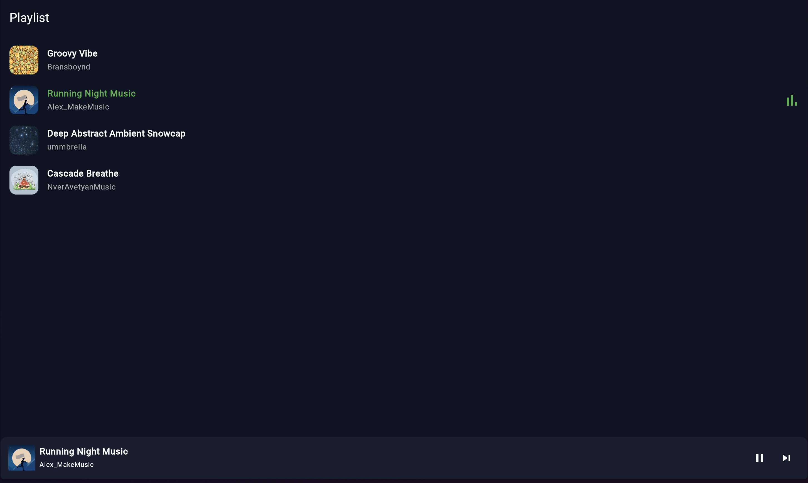
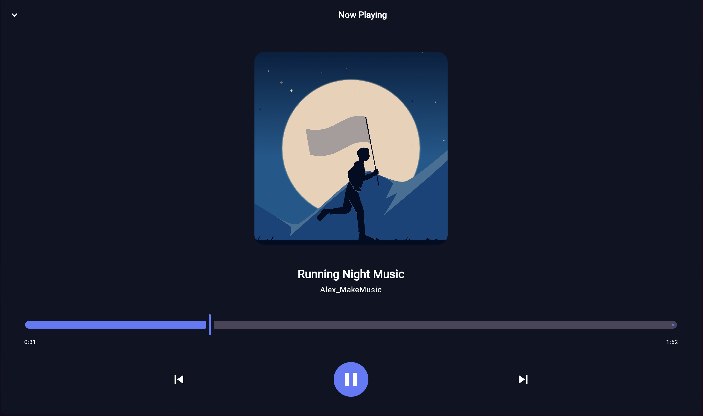

# 🎵 Kotlin Multiplatform Music Player

A simple **Kotlin Multiplatform (KMP)** music player application that runs on **Android**, **iOS**, and **Web (Kotlin/JS)**.  
Users can browse a playlist, start or stop playback, and scrub through the track timeline.

---

## 🧱 Architecture

The project is built using the **MVVM (Model–View–ViewModel)** architecture pattern, ensuring clear separation between UI, business logic, and data layers.

### Layers Overview:
- **Model (Shared):**
  - Defines data models for tracks (title, artist, cover image, URL, duration).
  - Contains playback state management and mock data provider.
- **ViewModel (Shared):**
  - Exposes state (`currentTrack`, `isPlaying`, `progress`, etc.) as observable properties.
  - Handles user actions such as play, pause, next, previous, and seek.
- **View (Platform-specific):**
  - Implemented using Compose Multiplatform for Android, iOS, and Web.
  - Reactively updates the UI based on state exposed by the shared ViewModel.

---

## 🌐 Platforms

| Platform | Framework | Notes |
|-----------|------------|-------|
| **Android** | Jetpack Compose | Standard Android app module. |
| **iOS** | Compose Multiplatform for iOS | Runs natively on iOS devices via Kotlin Multiplatform Mobile. |
| **Web** | Compose for Web (Kotlin/JS)** | Runs in the browser as a single-page app. |

Each platform shares the same logic and data models, differing only in the UI rendering layer.

---

## 🎶 Music Source

All music is **streamed from the internet**.  
Track data (title, artist, cover image, and music URL) is **mocked locally** for demonstration purposes — no backend or API is required.

## 🖼️ Screenshots

Below are example screenshots of the app running on all three supported platforms.

### 🤖 Android

| Playlist | Now Playing |
|-----------|-------------|
|  |  |

### 🍎 iOS

| Playlist | Now Playing |
|-----------|-------------|
|  |  |

### 🌐 Web (Kotlin/JS)

| Playlist | Now Playing |
|-----------|-------------|
|  |  |

